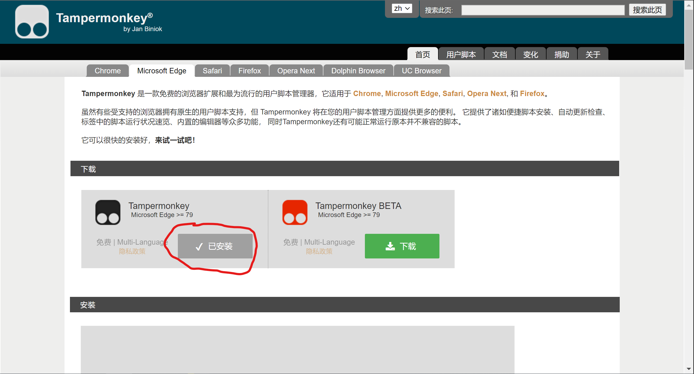
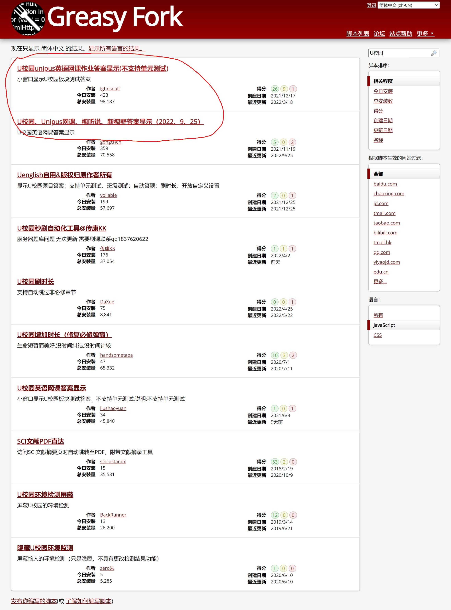
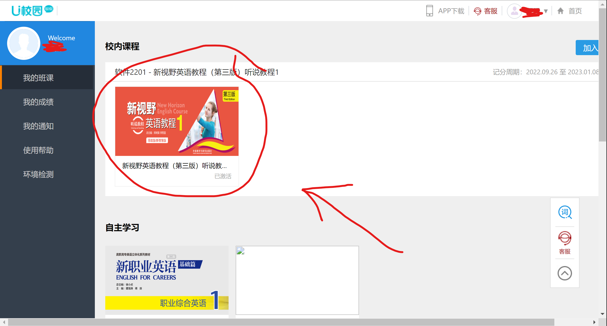
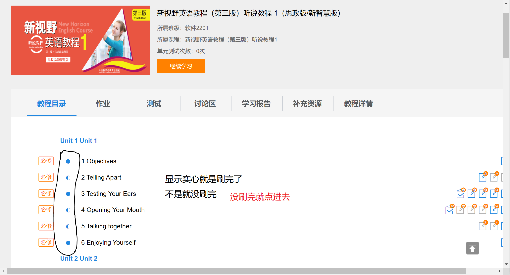
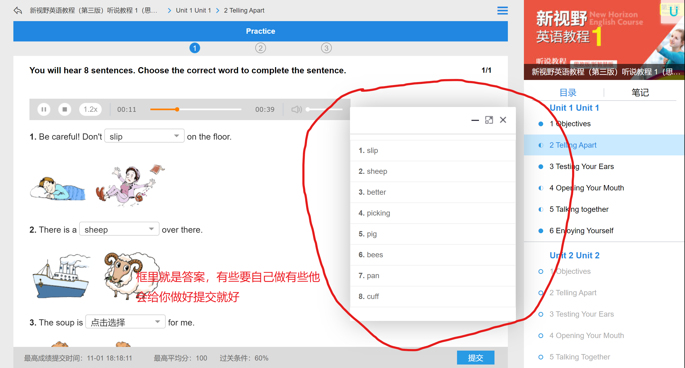

    <h1>U校园油猴查看答案</h1>

## 1.安装油猴插件

[油猴 • 首页](https://www.tampermonkey.net/)(<—点击)

点击下载

## 2.安装脚本

[Greasy Fork - 安全、实用的用户脚本大全](https://greasyfork.org/zh-CN)

搜索 U校园
前面两个都可以其他没试过可以自己试试
可以根据下载量来

## 3.进入U校园

[U校园 (unipus.cn)](https://u.unipus.cn/index.html/)

登录自己账号
点击进入课程

